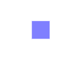

# 模型结构图

## 如何绘制一个深度学习模型图: 以Transformer为例

### 预备知识  
在正式开始深度模型图绘制之前，我们首先介绍一个非常重要的预备知识，即 复杂的网络图结构都可以解耦成若干个基础图形的组合。而他们的组合则是通过**node**命令实现的。
具体来说 Tikz绘图中的Node定义如下： 

~~~
\node[[line width], [shape], [draw], fill=[color], fill opacity=[], ...， [line shape]] (Names)(Optional) at (positions) {textual annotations};
~~~
其中：  
~~~
line width：thick、thin 等；   
shape：rectangle， circle 等；   
draw：可选项，若选择，则绘制出轮廓；  
fill: 用于对物体进行颜色填充，具体颜色可参考RGB定义，采用fill=[color]进行赋值。
fill opacity：用于设置填充颜色的透明度，取值范围为[0,1]。  
[line shape]: 设置线形的形状，主要选择如下， dotted、dashed等。
~~~

Example：<code>\node[thick, rectangle, fill=blue, fill opacity=0.5, dashed] (example1) at (0, 0) {};  </code>

其输出如下图所示。

### 从0到1绘制深度学习模型图
本章节我们将以Transformer模型（如下图所示）为例，进行实战讲解。

Step 1： 为模型图中的每一个组成单元定义特定的形状参数。这里主要采用的是\tikzstyle{}命令来进行设定。

~~~
\tikzstyle{Sanode} = [minimum height=1.4em,minimum width=7em,inner sep=3pt,rounded corners=1.5pt,draw,fill=orange!30];
\tikzstyle{Resnode} = [minimum height=1.1em,minimum width=7em,inner sep=3pt,rounded corners=1.5pt,draw,fill=yellow!30];
\tikzstyle{ffnnode} = [minimum height=1.4em,minimum width=7em,inner sep=3pt,rounded corners=1.5pt,draw,fill=blue!20];
\tikzstyle{outputnode} = [minimum height=1.4em,minimum width=7em,inner sep=3pt,rounded corners=1.5pt,draw,fill=blue!40];
\tikzstyle{inputnode} = [minimum height=1.4em,minimum width=3.5em,inner sep=3pt,rounded corners=1.5pt,draw,fill=red!20];
\tikzstyle{posnode} = [minimum height=1.4em,minimum width=3.5em,inner sep=3pt,rounded corners=1.5pt,draw,fill=black!10!white];
\tikzstyle{standard} = [rounded corners=3pt];
~~~
其中 minimum height 指定了图形的高度； minimum width 指定了图形的宽度； innner sep 指定了图形边框到文字的边距大小；rounded corners 则指定了图形连接处的弧度大小；其余参数上述介绍过，不再赘述。  
值得注意的是，上述步骤只是为了绘制过程中代码更加简洁明了,便于图形的修改，并非是必须的操作。经过上述定义后，如下命令等价：

~~~
\node[Sanode] (SAN) at (0, 0) {SAN};  
\node[minimum height=1.4em,minimum width=7em,inner sep=3pt,rounded corners=1.5pt,draw,fill=orange!30] (SAN) at (0, 0) {SAN};
~~~

Step 2: 对上述定义的形状进行布局设计。 这里从两个部分：encoder与decoder进行一一讲解。

~~~
Encoder:
    ""对encoder端的组成部分进行布局的设计""
    \node [Sanode,anchor=west] (sa1) at (0,0) {\tiny{$\textbf{SAN}$}};
    \node [Resnode,anchor=south] (res1) at ([yshift=0.3em]sa1.north) {\tiny{$\textbf{Add \& LayerNorm}$}};   
    \node [ffnnode,anchor=south] (ffn1) at ([yshift=1em]res1.north) {\tiny{$\textbf{FFN}$}};   
    \node [Resnode,anchor=south] (res2) at ([yshift=0.3em]ffn1.north) {\tiny{$\textbf{Add \& LayerNorm}$}};  
    \node [inputnode,anchor=north west] (input1) at ([yshift=-1em,xshift=-0.5em]sa1.south west) {\tiny{$\textbf{Emb.}$}}; 
    \node [] (add) at ([yshift=-1.6em,xshift=3.5em]sa1.south west) {$+$};
    \node [posnode,anchor=north east] (pos1) at ([yshift=-1em,xshift=0.5em]sa1.south east) {\tiny{$\textbf{Position}$}};
    \node [anchor=north] (inputs) at ([yshift=-3em]sa1.south) {\begin{CJK*}{UTF8}{gbsn}\scriptsize{$\textbf{ 我\ \ 很\ \ 好}$}\end{CJK*}};
    \node [anchor=south] (encoder) at ([xshift=0.2em,yshift=0.6em]res2.north west) {\scriptsize{\textbf{Encoder}}};

    ""对encoder端的组成部分进行连接""
    \draw [->] (sa1.north) -- (res1.south);
    \draw [->] (res1.north) -- (ffn1.south);
    \draw [->] (ffn1.north) -- (res2.south);
    \draw [->] ([yshift=-1em]sa1.south) -- (sa1.south);
    \draw [->] ([yshift=-0.3em]inputs.north) -- ([yshift=0.6em]inputs.north);
~~~

 
通过上述步骤，我们成功将不同的基本单元安置在其特定的位置上，并将其按照相应逻辑连接起来。上述代码本质上就是许多\node 命令的堆叠，并辅以连接线连接。然而在日常使用中，我们为了方便，许多时候都采用这样一种设计思想：选取一个固定点，并由该点进一步向四周扩散开来的绘图方式。 在上述代码中，我们选取的固定的为sa1， 其坐标是（0，0），其余的点都由其通过一定的偏移得到。   

由此又延伸出一个新的问题，如何高效地书写偏移代码，而不是通过线下独立计算得到。给定一个基准点A， 和一个点B, 其中B由A偏移S =（s_x, s_y）得到，点B的通用计算方法如下： B = A + S。  相应地，其对应的tikz代码如下：
~~~
B = ( [ xshift = s_x , yshift = s_y ] A.center )。 
~~~
通过上述代码，我们获取到偏移点的坐标，紧接着我们将其带入到\node命令中去，最终绘制出偏移点上对应的图形， 如下： 
~~~
\node[] at ([ xshift = s_x , yshift = s_y ] A.center) {};
~~~
由此，最终可以绘制出所有的基础图形。 Decoder 端原理与其相同，这里就不一一赘述了。此处仅提供代码如下：

~~~
Decoder:
    \node [Sanode,anchor=west] (sa2) at ([xshift=3em]sa1.east) {\tiny{$\textbf{Self-Attention}$}};
    \node [Resnode,anchor=south] (res3) at ([yshift=0.3em]sa2.north) {\tiny{$\textbf{Add \& LayerNorm}$}};
    \node [Sanode,anchor=south] (ed1) at ([yshift=1em]res3.north) {\tiny{$\textbf{Enc-Dec Attention}$}};
    \node [Resnode,anchor=south] (res4) at ([yshift=0.3em]ed1.north) {\tiny{$\textbf{Add \& LayerNorm}$}};
    \node [ffnnode,anchor=south] (ffn2) at ([yshift=1em]res4.north) {\tiny{$\textbf{FFN}$}};
    \node [Resnode,anchor=south] (res5) at ([yshift=0.3em]ffn2.north) {\tiny{$\textbf{Add \& LayerNorm}$}};
    \node [outputnode,anchor=south] (o1) at ([yshift=1em]res5.north) {\tiny{$\textbf{Output layer}$}};
    \node [inputnode,anchor=north west] (input2) at ([yshift=-1em,xshift=-0.5em]sa2.south west) {\tiny{$\textbf{Emb.}$}};
    \node [] (add) at ([yshift=-1.6em,xshift=3.5em]sa2.south west) {$+$};
    \node [posnode,anchor=north east] (pos2) at ([yshift=-1em,xshift=0.5em]sa2.south east) {\tiny{$\textbf{Position}$}};
    \node [anchor=north] (outputs) at ([yshift=-3em]sa2.south) {\begin{CJK*}{UTF8}{gbsn}\scriptsize{$\textbf{解码器输入: $<$sos$>$ I  am  fine}$}\end{CJK*}};
    \node [anchor=east] (decoder) at ([xshift=-1em,yshift=-1.5em]o1.west) {\begin{CJK*}{UTF8}{gbsn}\scriptsize{\textbf{Decoder}}\end{CJK*}};
    \node [anchor=north] (decoutputs) at ([yshift=1.5em]o1.north) {\begin{CJK*}{UTF8}{gbsn}\scriptsize{$\textbf{解码器输出: I  am  fine $<$eos$>$ }$}\end{CJK*}};

    \draw [->] (sa2.north) -- (res3.south);
    \draw [->] (res3.north) -- (ed1.south);
    \draw [->] (ed1.north) -- (res4.south);
    \draw [->] (res4.north) -- (ffn2.south);
    \draw [->] (ffn2.north) -- (res5.south);
    \draw [->] (res5.north) -- (o1.south);
    \draw [->] (o1.north) -- ([yshift=0.5em]o1.north);
    \draw [->] ([yshift=-1em]sa2.south) -- (sa2.south);
    \draw [->] ([yshift=-0.3em]outputs.north) -- ([yshift=0.6em]outputs.north);

Encoder-Decoder:
    \draw[->,standard] ([yshift=-0.5em]sa1.south) -- ([xshift=-4em,yshift=-0.5em]sa1.south) -- ([xshift=-4em,yshift=2.3em]sa1.south) -- ([xshift=-3.5em,yshift=2.3em]sa1.south);
    \draw[->,standard] ([yshift=0.5em]res1.north) -- ([xshift=-4em,yshift=0.5em]res1.north) -- ([xshift=-4em,yshift=3.3em]res1.north) -- ([xshift=-3.5em,yshift=3.3em]res1.north);

    \draw[->,standard] ([yshift=-0.5em]sa2.south) -- ([xshift=4em,yshift=-0.5em]sa2.south) -- ([xshift=4em,yshift=2.3em]sa2.south) -- ([xshift=3.5em,yshift=2.3em]sa2.south);
    \draw[->,standard] ([yshift=0.5em]res3.north) -- ([xshift=4em,yshift=0.5em]res3.north) -- ([xshift=4em,yshift=3.3em]res3.north) -- ([xshift=3.5em,yshift=3.3em]res3.north);
    \draw[->,standard] ([yshift=0.5em]res4.north) -- ([xshift=4em,yshift=0.5em]res4.north) -- ([xshift=4em,yshift=3.3em]res4.north) -- ([xshift=3.5em,yshift=3.3em]res4.north);

    \draw[->,standard] (res2.north) -- ([yshift=0.5em]res2.north) -- ([xshift=5em,yshift=0.5em]res2.north) -- ([xshift=5em,yshift=-2.2em]res2.north) -- ([xshift=6.5em,yshift=-2.2em]res2.north);
    \node [ugreen,font=\scriptsize] (count) at ([xshift=-1.5em,yshift=-1em]encoder.south) {$6\times$};
    \node [red,font=\scriptsize] (count) at ([xshift=10.8em,yshift=0em]decoder.south) {$\times 6$};
~~~

 

